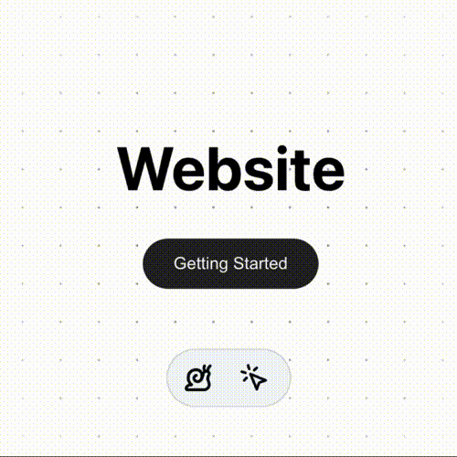
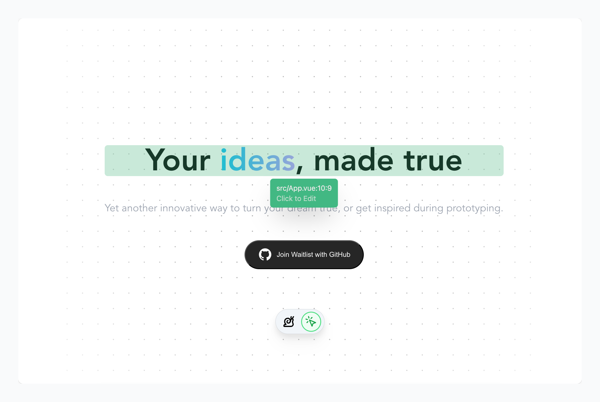

# Guii DevTools

> ❤️ 充满爱的 AI 结对编程神器 —— 🐌 Guii Devtool，轻松融入现有前端项目，通过自然语言指令即可轻松定制和优化代码。我们不替代创造者或 Hackers，只愿成为他们桌旁的亲密伙伴，✨ 共同创造美好的产品。

<p align="center">
  
</p>

<p align="center">
    <a href="https://www.bilibili.com/video/BV131421t7Jk">它是如何运作的？请观看我们的演示视频！</a>| <a href="https://guii.app">官网</a>
</p>

<p align="center">
    <a href="https://discord.gg/jVNjbbUJmy">加入 Discord 服务器 </a>
</p>

<p align="center">
    <span>加入微信群</span>
</p>

<p align="center">
    
</p>

- [x] 🚀 在开发项目内安装插件即可使用
- [x] 🧳 0 配置支持前端开发者们最喜欢的热重载功能
- [x] 🔨 和 Nuxt DevTools 一样的辅助开发能力
- [x] ☝️ 激活，选中，修改，审查代码，和 Guii AI 一起写前端
- [x] 🌎 支持任意前端框架，Vue，React，Angular，Svelte，等等

## How



1. 安装 Guii DevTools 到前端项目中
2. 配置 Vite，Webpack 插件：

```javascript
import { DevTools } from '@guiijs/core'

export default defineConfig() {
  return {
    plugins: [
      DevTools()
    ]
  }
}
```

3. 启动项目，打开浏览器，找到 Guii DevTools 浮窗
4. 激活小鼠标
5. 选中元素
6. 通过自然语言指令修改代码
7. 和 LLM 还有 Guii AI 一起写前端！

## 如何开发

该项目使用 [`unbuild`](https://github.com/unjs/unbuild)和 [`vite`](https://github.com/vitejs/vite)进行开发和构建。有了 [`jiti`](https://github.com/unjs/jiti)提供的强大功能，我们不再需要使用 [Rollup](https://rollupjs.org/) 进行繁琐的配置，然后观察本地文件的变化，并在没有 [`vite`](https://github.com/vitejs/vite)进行热加载的情况下捆绑修改和开发的模块。我们可以直接运行以下命令输出捆绑文件并开始开发：

```shell
# run these scripts in root folder
pnpm i
pnpm run packages:stub
```

如果你使用 [`@antfu/ni`](https://github.com/antfu/ni)，也可以使用下面的命令：

```shell
nr packages:stub
```

现在，启动 Vue3 Playground：

```shell
pnpm run play:vue
```

如果你使用 [`@antfu/ni`](https://github.com/antfu/ni)，也可以使用下面的命令：

```shell
nr docs:dev
```

## 如何构建

```shell
pnpm run packages:build
```

如果你使用 [`@antfu/ni`](https://github.com/antfu/ni)，也可以使用下面的命令：

```shell
nr packages:build
```

用下面的命令构建：

```shell
pnpm run docs:build
```

如果你使用 [`@antfu/ni`](https://github.com/antfu/ni)，也可以使用下面的命令：

```shell
nr docs:build
```

## 关于我们

### 成员（排名不分先后）

#### Rizumu (@LittleSound)

- [Github](https://github.com/LittleSound)

开源老手，著名的前三大前端框架之一的第二大框架 [Vue.js](https://vuejs.org) 的核心成员，在开发的过程中帮助我们团队深入 Vue.js 底层，从编译器的角度处理得到了开发服务器的界面到源代码的映射。

#### 特菈（@Dustella）

- [Github](https://github.com/Dustella)

前端核心开发者，撰写了非常多的前端界面，和我们的动画样式调优和封装，让我们的 DevTools 界面更加美观和易用。

#### RainbowBird（@luoling8192）

- [Github](https://github.com/luoling8192)

后端核心开发者，负责提示词，工作流和 Agent 编排的开发，让我们的 DevTools 更加智能和易用。

#### Neko（@nekomeowww)

- [Github](https://github.com/nekomeowww)

核心开发者，串联起了整个项目的前后端，打通了实时编辑和热重载、完成架构设计、API 设计、规范统一化、工具链和提供 LLM 调用和设计的最佳实践，让我们的 DevTools 更加完整和易用。

## Star History

[](https://star-history.com/#guiiapp/guii-devtools&Date)

<!-- ## 项目状态

 -->

## 贡献者们

感谢每一位为 Guii DevTools 项目做出贡献的朋友们！

[](https://github.com/guiiapp/guii-devtools/graphs/contributors)

### Written with ♥
